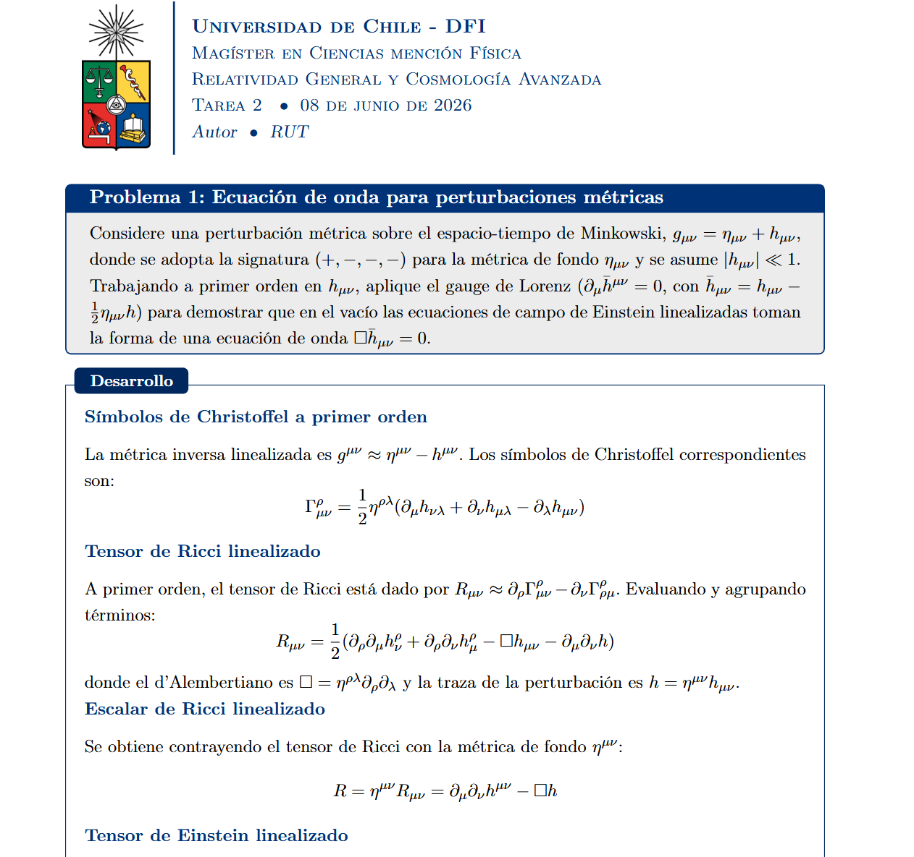

# Plantilla Modular de LaTeX para Física Teórica y Matemáticas

Plantilla LaTeX optimizada para la resolución estructurada de problemas de postgrado, cálculo tensorial y física matemática.

https://www.overleaf.com/read/wvvymxgkkcdh#8a00c8

## 📂 Estructura del Proyecto

* `main.tex`: Archivo fuente principal del documento.
* `aleph-comandos.sty`: Paquete de macros y operadores avanzados.
* `aleph-moodle.sty`: Módulo de compatibilidad y exportación.
* `aleph-notas.cls`: Clase raíz para la maquetación estructural y tipográfica.
* `Logos/`: Recursos gráficos e insignias institucionales.

---

## 🛠️ Paquetes y Automatizaciones Core

El archivo `aleph-comandos.sty` precarga y configura las siguientes herramientas:

* **Física y Tensores:** `physics` (notación Dirac, operadores), `tensor` (alineación estricta de índices covariantes/contravariantes), `slashed` (notación de Feynman) y `siunitx` (magnitudes e incertidumbres).
* **Bloques Dinámicos:** `tcolorbox` (con `skins` y `breakable`) para entornos `problema`, `desarrollo` y `formulario`.
* **Saltos Atómicos:** El entorno `problema` incorpora un contador lógico interno que ejecuta un `\clearpage` automático a partir del segundo ejercicio.

---

## 🚀 Previsualización



---

## ⚙️ Configuración del Entorno

Distribución de LaTeX (TeX Live o MiKTeX) con los paquetes especificados en aleph-comandos.sty.

---

## 📜 Licencia
Componentes de la plantilla base pertenecientes al proyecto Alephsub0, modificados y adaptados en diseño y sintaxis, bajo Licencia MIT.

---

## 📋 Compilación

El proyecto está diseñado para compilarse mediante **pdfLaTeX**:

```bash
pdflatex main.tex

